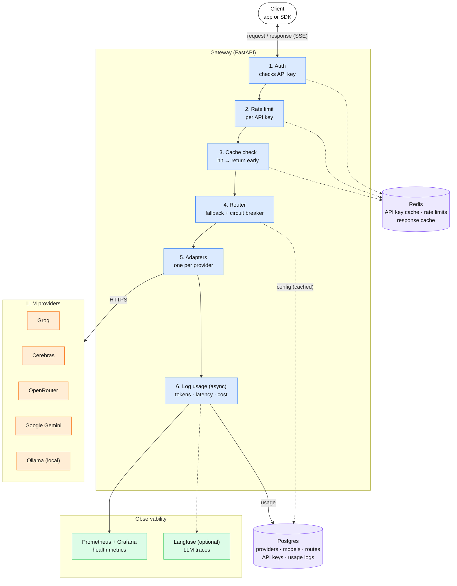

# llm-gateway
An LLM Gateway that routes requests according to the task, and can be called using a single API endpoint.

## Architecture

```mermaid
flowchart TB
    Client(["Client<br/>app or SDK"])

    subgraph GW["Gateway (FastAPI)"]
        Auth["1. Auth<br/>checks API key"]
        RL["2. Rate limit<br/>per API key"]
        Cache["3. Cache check<br/>hit → return early"]
        Router["4. Router<br/>fallback + circuit breaker"]
        Adapters["5. Adapters<br/>one per provider"]
        Logger["6. Log usage (async)<br/>tokens · latency · cost"]
    end

    Redis[("Redis<br/>API key cache · rate limits<br/>response cache")]
    Postgres[("Postgres<br/>providers · models · routes<br/>API keys · usage logs")]

    subgraph P["LLM providers"]
        Groq
        Cerebras
        OpenRouter
        Gemini["Google Gemini"]
        Ollama["Ollama (local)"]
    end

    subgraph OBS["Observability"]
        Prom["Prometheus + Grafana<br/>health metrics"]
        Langfuse["Langfuse (optional)<br/>LLM traces"]
    end

    Client <-->|"request / response (SSE)"| Auth
    Auth --> RL --> Cache --> Router --> Adapters
    Adapters -->|HTTPS| P
    Adapters --> Logger

    Auth -.-> Redis
    RL -.-> Redis
    Cache -.-> Redis
    Router -.->|"config (cached)"| Postgres
    Logger -->|usage| Postgres
    Logger --> Prom
    Logger -.-> Langfuse

    classDef step fill:#dbeafe,stroke:#3b82f6,color:#111
    classDef store fill:#ede9fe,stroke:#8b5cf6,color:#111
    classDef ext fill:#ffedd5,stroke:#f97316,color:#111
    classDef obs fill:#dcfce7,stroke:#22c55e,color:#111
    classDef client fill:#ffffff,stroke:#333,color:#111
    class Auth,RL,Cache,Router,Adapters,Logger step
    class Redis,Postgres store
    class Groq,Cerebras,OpenRouter,Gemini,Ollama ext
    class Prom,Langfuse obs
    class Client client
```

